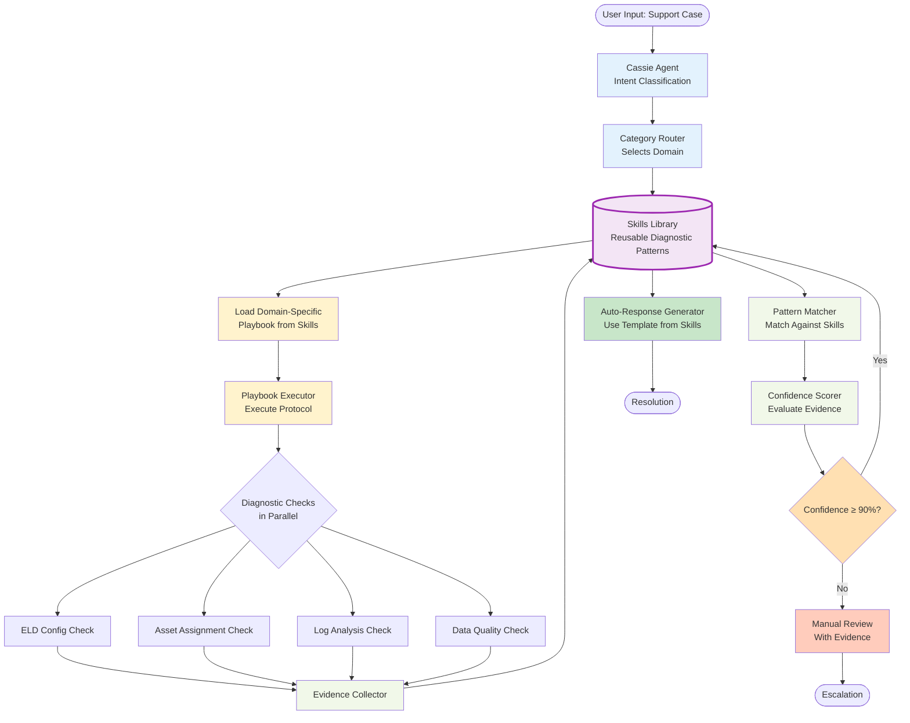
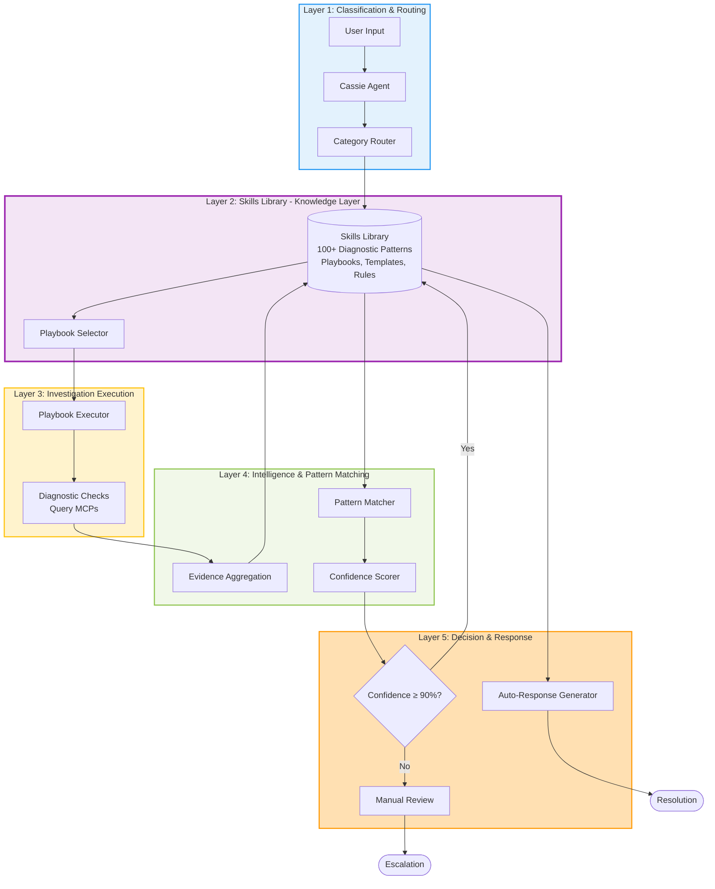
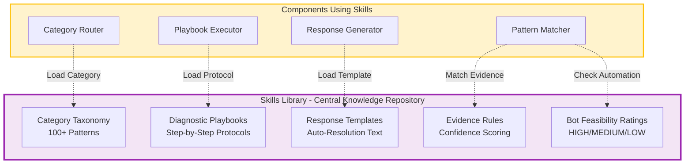
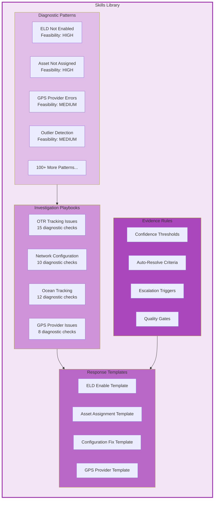

# Architecture with Skills Library Layer

## Complete Architecture with Skills Library



## 5-Layer Architecture View



## Skills Library Architecture Detail



## Skills Library Contents



## Data Flow Through Skills Library

```mermaid
flowchart LR
    subgraph Input[Case Input]
        Case[Support Case<br/>Load Not Tracking]
    end

    subgraph Classification[Classification]
        Cassie[Cassie Agent]
        Router[Category Router]
    end

    subgraph SkillsLayer[Skills Library Layer]
        Skills[(Skills Library)]
        SelectPlaybook[Select Playbook:<br/>OTR Tracking Issues]
        SelectPattern[Pattern Library:<br/>100+ Patterns]
        SelectTemplate[Template Library:<br/>Response Templates]
    end

    subgraph Execution[Investigation Execution]
        Executor[Playbook Executor]
        MCPs[(5 MCP Servers)]
        Evidence[Evidence Collector]
    end

    subgraph Decision[Decision Layer]
        Matcher[Pattern Matcher]
        Scorer[Confidence Scorer]
        Generator[Response Generator]
    end

    Case --> Cassie --> Router
    Router -.1. Load Category.-> Skills
    Skills --> SelectPlaybook
    SelectPlaybook --> Executor
    Executor -.2. Query Data.-> MCPs
    MCPs -.3. Return Data.-> Evidence
    Evidence -.4. Match Pattern.-> Skills
    Skills --> SelectPattern
    SelectPattern --> Matcher --> Scorer
    Scorer -.5. High Confidence.-> Skills
    Skills --> SelectTemplate
    SelectTemplate --> Generator

    style Input fill:#e3f2fd
    style Classification fill:#e3f2fd
    style SkillsLayer fill:#f3e5f5,stroke:#9c27b0,stroke-width:3px
    style Execution fill:#fff3cd
    style Decision fill:#f1f8e9
```

---

## Key Insight: Skills Library as Reusable Knowledge

The **Skills Library** is the central knowledge repository that:

1. **Captures Institutional Knowledge:**
   - 100+ diagnostic patterns from expert support engineers
   - Validated playbooks from thousands of historical cases
   - Proven response templates

2. **Enables Reusability:**
   - Same skills can be used across multiple AI agents
   - New agents can leverage existing diagnostic intelligence
   - Continuous improvement benefits all consumers

3. **Maintains Separation of Concerns:**
   - Knowledge (Skills Library) separate from execution (Playbook Executor)
   - Classification (Cassie) doesn't contain diagnostic logic
   - MCPs provide data, not intelligence
   - Investigation engine orchestrates, doesn't own patterns

4. **Supports Rapid Development:**
   - Add new pattern → instantly available to all agents
   - Update existing pattern → all consumers benefit
   - No code changes needed for pattern modifications

---

## Color Legend

- **Purple (#f3e5f5):** Skills Library Layer - The Knowledge Repository
- **Blue (#e3f2fd):** Classification Layer
- **Yellow (#fff3cd):** Investigation/Execution Layer
- **Green (#f1f8e9):** Intelligence/Pattern Matching Layer
- **Orange (#ffe0b2):** Decision Layer

---
