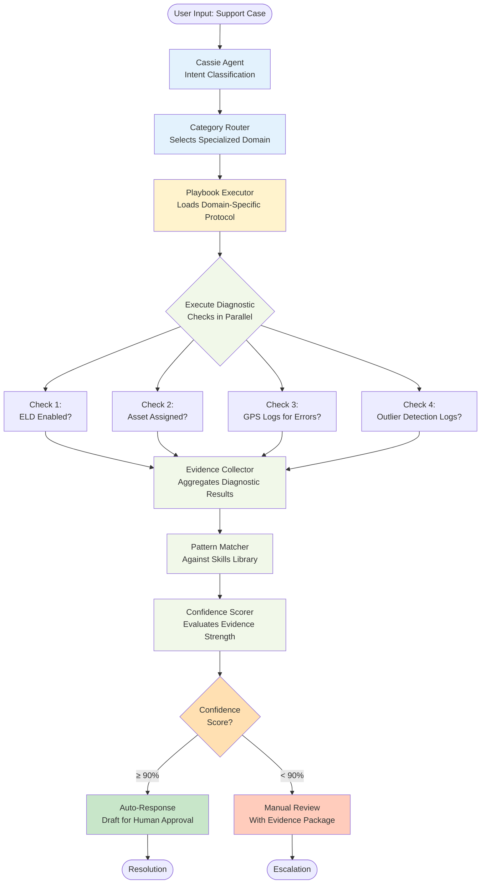
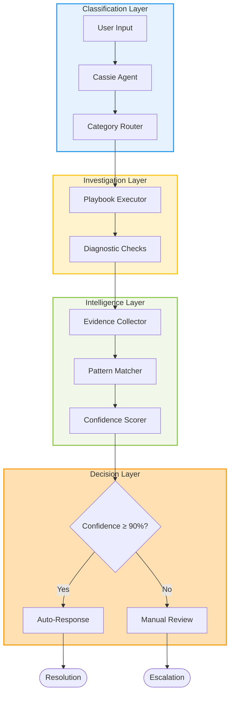
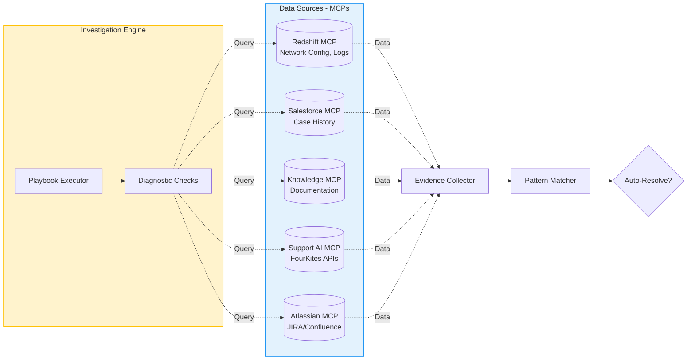
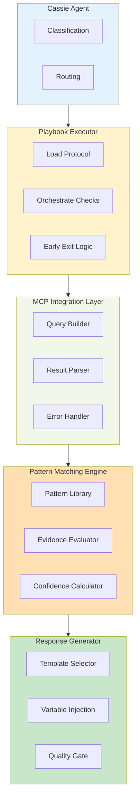
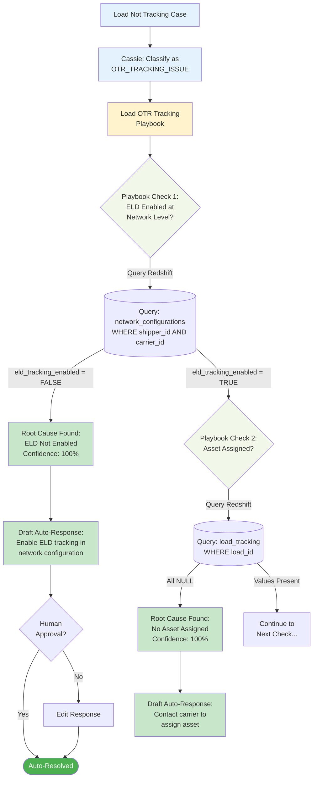

# Recommended Cassie Agent Architecture - Mermaid Diagram

## Full Architecture Flow

## Simplified View with Layers

## Data Flow with MCPs

## Component Responsibilities

## Decision Flow Example - ELD Not Enabled

---

## How to Use These Diagrams

**For Documentation:**
- Copy any diagram code block to your Markdown files
- GitHub, GitLab, and many doc tools render Mermaid automatically

**For Presentations:**
- Paste into https://mermaid.live to generate PNG/SVG
- Or use Mermaid plugins in VS Code, Notion, Confluence

**For Architecture Discussions:**
- Use "Simplified View with Layers" for high-level overview
- Use "Full Architecture Flow" for detailed technical discussion
- Use "Decision Flow Example" to walk through specific scenarios

---
